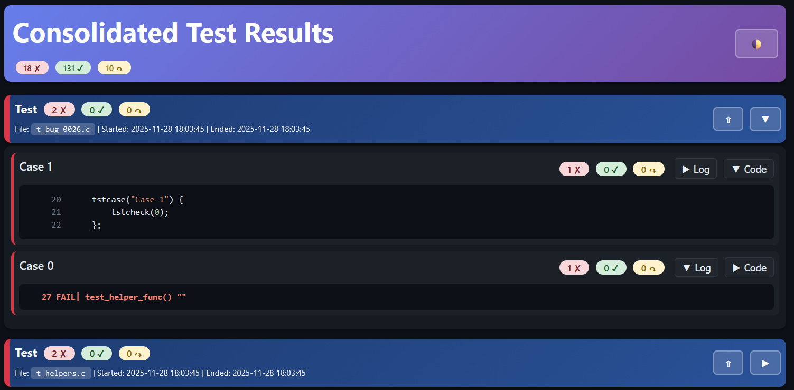

<div align="center">
  
  
  # TST - Simple C Testing Framework
  
  [](https://github.com/rdentato/tst/releases)
  [](LICENSE)
  [](#supported-platforms)
  [](https://discord.gg/BqsZjDaUxg)
  
  **A lightweight, single-header unit testing framework for C and C++ with zero dependencies**
  
  [Features](#features) •
  [Quick Start](#quick-start) •
  [Documentation](#documentation) •
  [Examples](#examples) •
  [Contributing](#contributing)
  
</div>

---

## 📋 Table of Contents

- [Overview](#overview)
- [Features](#features)
- [Quick Start](#quick-start)
  - [Installation](#installation)
  - [Your First Test](#your-first-test)
  - [Compile and Run](#compile-and-run)
- [Examples](#examples)
- [HTML Reports](#html-reports)
- [Documentation](#documentation)
- [Supported Platforms](#supported-platforms)
- [Building from Source](#building-from-source)
- [Running Tests](#running-tests)
- [Contributing](#contributing)
- [License](#license)
- [Authors](#authors)
- [Acknowledgments](#acknowledgments)

---

## Overview

**TST** is a modern, lightweight unit testing framework designed specifically for C programs (with full C++ compatibility). Born from the frustration of dealing with complex test frameworks that require extensive build configurations and dependencies, TST provides a simple yet powerful testing solution in a single header file.

### Why TST?

- **🚀 Zero Setup**: Just include `tst.h` and start writing tests
- **📦 Single Header**: Less than 300 lines of code, no external dependencies
- **🎯 Simple Syntax**: Intuitive macros that feel natural in C
- **⚡ Fast**: Minimal overhead, optimized for performance
- **🔍 Rich Output**: Structured logs perfect for both humans and CI/CD pipelines
- **📊 HTML Reports**: Beautiful interactive dashboards with source code extraction
- **🏷️ Tag-Based Filtering**: Run specific test subsets with command-line tags
- **📈 Data-Driven Tests**: Built-in support for parameterized testing
- **⏱️ Performance Timing**: Integrated CPU time measurement
- **🔧 Flexible**: Works with any C compiler on any platform

---

## Features

### Core Testing Features

- ✅ **Hierarchical Test Organization**: Suites → Cases → Sections
- ✅ **Multiple Assertion Types**: `tstcheck`, `tstassert`, `tstexpect`
- ✅ **Conditional Execution**: `tstskipif` for runtime test skipping
- ✅ **Tag-Based Filtering**: Selective test execution with `+Tag` / `-Tag`
- ✅ **Data-Driven Testing**: Automatic iteration over test data arrays
- ✅ **Performance Measurement**: Built-in `tstclock` for timing
- ✅ **Formatted Messages**: Printf-style assertion messages
- ✅ **Rich Diagnostics**: Notes, output blocks, and custom logging

### HTML Report Generator (t2h)

- 📊 **Interactive Dashboards**: Click to expand logs and source code
- 🎨 **Syntax Highlighting**: Color-coded C/C++ source with keyword highlighting
- 📁 **Multi-Suite Support**: Consolidate multiple test logs into one report
- 🌓 **Light/Dark Themes**: Toggle between themes for comfortable viewing
- 📈 **Visual Statistics**: Pie charts and progress bars for pass/fail/skip distribution
- 🔍 **Source Extraction**: Automatic extraction of test case source code
- 🎯 **Line Number Mapping**: Links between logs and source code

### Developer Experience

- 🛠️ **No Build System Required**: Direct compilation with any C compiler
- 📝 **Self-Documenting**: Test names serve as specifications
- 🐛 **CI/CD Friendly**: `--report-error` flag for build pipelines
- 🌍 **Cross-Platform**: Linux, macOS, Windows (WSL, MinGW, MSVC)
- 🔗 **Zero Dependencies**: Uses only standard C library

---

## Quick Start

### Installation

#### Option 1: Copy the Header (Recommended)

Download `tst.h` and copy it to your project:

```bash
# Download from GitHub
curl -o tst.h https://raw.githubusercontent.com/rdentato/tst/main/src/tst.h

# Or clone the repository
git clone https://github.com/rdentato/tst.git
cp tst/src/tst.h /path/to/your/project/
```

#### Option 2: Clone the Repository

```bash
git clone https://github.com/rdentato/tst.git
cd tst
```

### Your First Test

Create a file `test_example.c`:

```c
#include "tst.h"

tstsuite("My First Test Suite") {
    tstcase("Basic Arithmetic") {
        tstcheck(1 + 1 == 2, "Addition works");
        tstcheck(5 * 4 == 20, "Multiplication works");
    }
    
    tstcase("String Functions") {
        tstcheck(strlen("hello") == 5);
        tstcheck(strcmp("abc", "abc") == 0);
    }
}
```

### Compile and Run

```bash
# Compile (no special flags needed)
gcc -o test_example test_example.c

# Run tests
./test_example
```

**Output:**
```
----- SUIT / test_example.c "My First Test Suite" 2025-11-27 10:30:45
CASE,-- Basic Arithmetic
    4 PASS|  1 + 1 == 2
    5 PASS|  5 * 4 == 20
    `--- 0 FAIL | 2 PASS | 0 SKIP
CASE,-- String Functions
    9 PASS|  strlen("hello") == 5
   10 PASS|  strcmp("abc", "abc") == 0
    `--- 0 FAIL | 2 PASS | 0 SKIP
^^^^^ RSLT \ 0 FAIL | 4 PASS | 0 SKIP 2025-11-27 10:30:45
```

---

## Examples

### Data-Driven Testing

Test the same logic with multiple inputs:

```c
tstcase("Factorial Tests") {
    struct {int input; int expected;} tstdata[] = {
        {0, 1},
        {1, 1},
        {5, 120},
        {10, 3628800}
    };
    
    tstsection("Calculate factorial(%d)", tstcurdata.input) {
        int result = factorial(tstcurdata.input);
        tstcheck(result == tstcurdata.expected,
                "Expected %d, got %d", tstcurdata.expected, result);
    }
}
```

### Tag-Based Filtering

Organize tests by type and run selectively:

```c
tstsuite("API Tests") {
    tstcase("Fast Unit Test", -SlowTests) {
        tstcheck(quick_function() == 0);
    }
    
    tstcase("Database Integration", +RequiresDB, +Integration) {
        tstcheck(db_connect() == 0);
        tstcheck(db_query("SELECT 1") == 0);
    }
}
```

Run only fast tests:
```bash
./test_api -SlowTests
```

Run integration tests:
```bash
./test_api +Integration
```

### Performance Measurement

Measure execution time with built-in timing:

```c
tstclock("Sort 10000 elements") {
    quicksort(array, 10000);
}

tstcheck(is_sorted(array, 10000));
tstcheck(tstelapsed() < 1000000, "Should complete in < 1s");
```

### Conditional Skipping

Skip tests based on runtime conditions:

```c
tstcase("Database Tests") {
    int db_available = check_database();
    
    tstskipif(!db_available) {
        tstcheck(db_query("SELECT * FROM users") == 0);
        tstcheck(db_insert("user1") == 0);
    }
}
```

For more examples, see the [tutorial](tutorial/) directory or the [programmer's manual](docs/prog_manual.md).

---

## Shell Testing with tst.sh

TST also provides **tst.sh**, a bash library for writing shell-based tests that produce TST-formatted output.

### Quick Shell Test Example

```bash
#!/bin/bash
source "path/to/tst.sh"

tstsuite_begin "Shell Script Tests" "$0"

tstcase_begin "File operations"
  # Auto-detect line numbers
  tstpass "test -f README.md"
  
  result=$(cat README.md | wc -l)
  if [ "$result" -gt 0 ]; then
    tstpass "README.md has content"
  else
    tstfail "README.md has content" "File is empty"
  fi
tstcase_end

tstcase_begin "Command tests"
  tstnote "Testing basic commands"
  
  # Explicit line number (for helper functions)
  if ls /tmp > /dev/null 2>&1; then
    tstpass $LINENO "ls /tmp succeeds"
  fi
tstcase_end

tstsuite_end
```

### Features

- **TST-Compatible Output**: Generates logs that work with `t2h` HTML reports
- **Auto-Detect Line Numbers**: Uses `${BASH_LINENO[0]}` for automatic line tracking
- **Flexible API**: Mirror of tst.h functions for bash scripts
- **Helper Functions**: Built-in comparisons (`tst_equal`, `tst_greater`, etc.)

See the [Programmer's Manual](docs/prog_manual.md) for complete tst.sh documentation.

---

## HTML Reports

The `t2h` utility converts test logs into beautiful, interactive HTML reports.

<div align="center">
  
  <p><em>Example of an interactive HTML test report generated by t2h</em></p>
</div>

### Generate a Report

```bash
# From test output
./test_program | t2h > report.html

# From log files
t2h test1.log test2.log > consolidated.html

# With light theme
t2h --light test.log > report.html
```

### Features

<table>
<tr>
<td width="50%">

**Interactive UI**
- Click test cases to expand logs
- Toggle between log and source views
- Collapsible sections for multi-suite reports
- Light/Dark theme toggle

</td>
<td width="50%">

**Rich Visualizations**
- Collapsable test case details
- Color-coded status indicators
- Color-coded log lines
- Syntax-highlighted source code

</td>
</tr>
</table>

### Building t2h

```bash
cd src
make t2h

# Or manually
gcc -o t2h t2h.c -lm
```

---

## Documentation

### Quick Reference

| Document | Description |
|----------|-------------|
| [Programmer's Manual](docs/prog_manual.md) | Comprehensive guide with tutorials and examples |
| [Reference Manual](docs/ref_manual.md) | Complete API reference for tst.h, tst.sh, and t2h |
| [Tutorial](tutorial/README.md) | Step-by-step introduction to TST features |
| [Design Documents](docs/design/) | Architecture and implementation details |

### Key Concepts

- **Test Suite**: Top-level container (one per source file)
- **Test Case**: Group of related checks with partial results
- **Test Section**: Isolated subsection with setup/teardown
- **Assertions**: `tstcheck` (continue), `tstassert` (abort), `tstexpect` (silent)
- **Tags**: Runtime filters for selective test execution
- **Data-Driven**: Arrays named `tstdata` for parameterized tests

### API Cheat Sheet

```c
// Suite definition
tstsuite("Suite Name") { /* tests */ }

// Test organization
tstcase("Case Name") { /* checks */ }
tstsection("Section %d", val) { /* isolated checks */ }

// Assertions
tstcheck(expr, "message %d", val);    // Continue on failure
tstassert(expr, "critical");          // Abort on failure
tstexpect(expr, "silent on pass");    // Only print failures

// Control flow
tstskipif(condition) { /* skipped tests */ }

// Tags (in tstcase)
tstcase("Test", +RequiresDB, -SlowTests) { }

// Diagnostics
tstnote("Info message %d", val);
tstprintf("Debug output\n");
tstouterr("Block output:") { tstprintf("...\n"); }

// Timing
tstclock("Operation") { /* code */ }
clock_t elapsed = tstelapsed();

// Data-driven
int tstdata[] = {1, 2, 3};
tstsection("Test %d", tstcurdata) { /* runs 3 times */ }
```

---

## Supported Platforms

TST has been tested and confirmed to work on the following platforms:

| Platform | Compiler | Status |
|----------|----------|--------|
| **Linux** | gcc, g++, clang | ✅ Fully Supported |
| **macOS** | clang (Apple) | ✅ Fully Supported |
| **Windows WSL2** | gcc, g++, clang | ✅ Fully Supported |
| **Windows** | MSVC (cl), MinGW | ✅ Fully Supported |

### Compiler Requirements

- **C**: C99 or later (C89 compatible with minor limitations)
- **C++**: C++98 or later (automatic `extern "C"` handling)

### Tested Compilers

- GCC 7.0+
- Clang 6.0+
- MSVC 2017+
- MinGW-w64 8.0+

---

## Building from Source

### Build tst.h Tests

```bash
# From repository root
make runtest

# Or manually
cd test
make
./tstrun
```

### Build t2h Utility

```bash
cd src
make t2h

# Or with specific compiler
CC=clang make t2h
```

### Build Everything

```bash
# From repository root
make
```

---

## Running Tests

### Basic Execution

```bash
# Run all tests
./test_program

# List available tests and tags
./test_program --list

# Return error code on failure (for CI)
./test_program --report-error
```

### Tag Filtering

```bash
# Enable specific tags
./test_program +RequiresDB +Integration

# Disable specific tags
./test_program -SlowTests

# Enable all tagged tests
./test_program +*

# Complex filtering (later overrides earlier)
./test_program +* -SlowTests +Integration
```

### Environment Variables

```bash
# Set default options
export TSTOPTIONS="--report-error +* -ManualTests"
./test_program  # Uses TSTOPTIONS
```

---

## Contributing

We welcome contributions! Whether it's bug reports, feature requests, documentation improvements, or code contributions.

### How to Contribute

1. **Fork the repository**
2. **Create a feature branch**: `git checkout -b feature/amazing-feature`
3. **Make your changes**
4. **Run tests**: `make runtest`
5. **Commit your changes**: `git commit -m 'Add amazing feature'`
6. **Push to the branch**: `git push origin feature/amazing-feature`
7. **Open a Pull Request**

### Guidelines

- Follow the existing code style (K&R style, 2-space indents)
- Add tests for new features
- Update documentation as needed
- Keep commits focused and atomic
- Write clear commit messages

### Reporting Issues

Found a bug? Have a question? [Open an issue](https://github.com/rdentato/tst/issues) on GitHub.

### Join the Discussion

- **Discord**: [Join our community](https://discord.gg/BqsZjDaUxg)

---

## License

This project is licensed under the **MIT License** - see the [LICENSE](LICENSE) file for details.

```
Copyright (c) 2023-2025 Remo Dentato

Permission is hereby granted, free of charge, to any person obtaining a copy
of this software and associated documentation files (the "Software"), to deal
in the Software without restriction, including without limitation the rights
to use, copy, modify, merge, publish, distribute, sublicense, and/or sell
copies of the Software...
```

---

## Authors

**Remo Dentato** - *Creator and Maintainer*
- GitHub: [@rdentato](https://github.com/rdentato)

See also the list of [contributors](https://github.com/rdentato/tst/contributors) who participated in this project.

---

## Acknowledgments

- Inspired by the simplicity of testing frameworks like Catch2 and doctest
- Thanks to all contributors and users who provided feedback
- Special thanks to the C programming community

---

## Project Status

**Current Version**: 0.8.1-beta  
**Status**: Active Development  
**Stability**: Beta (API may change before 1.0 release)

### Roadmap

- [ ] 1.0.0 Release with stable API
- [ ] JUnit XML output format
- [ ] Test coverage integration
- [ ] Visual Studio Code extension
- [ ] CMake integration helpers

---

<div align="center">

**⭐ If you find TST useful, please consider giving it a star on GitHub! ⭐**

[Report Bug](https://github.com/rdentato/tst/issues) •
[Request Feature](https://github.com/rdentato/tst/issues) •
[Documentation](docs/manual.md) •
[Discord](https://discord.gg/BqsZjDaUxg)

Made with ❤️ by [Remo Dentato](https://github.com/rdentato)

</div>
